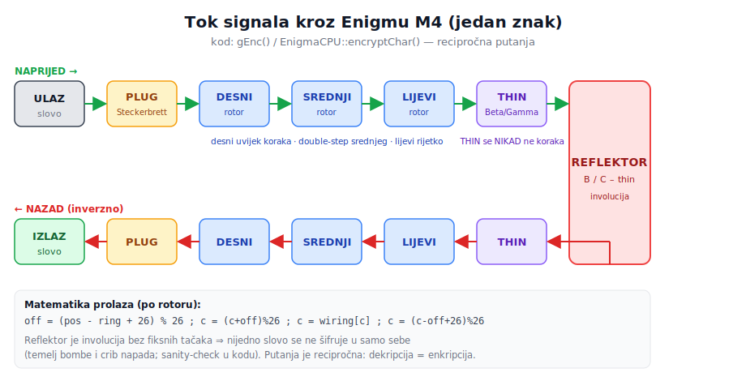
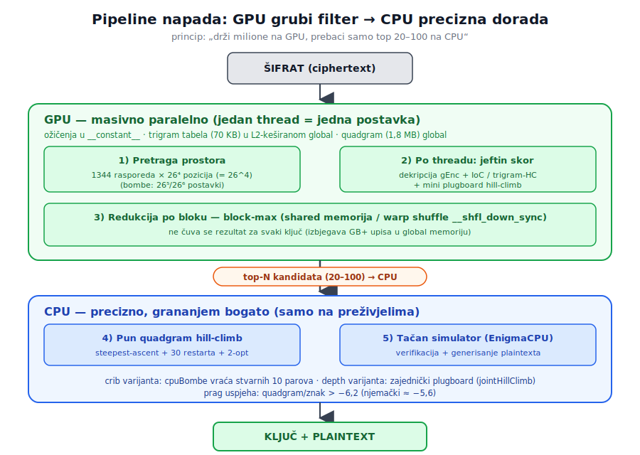
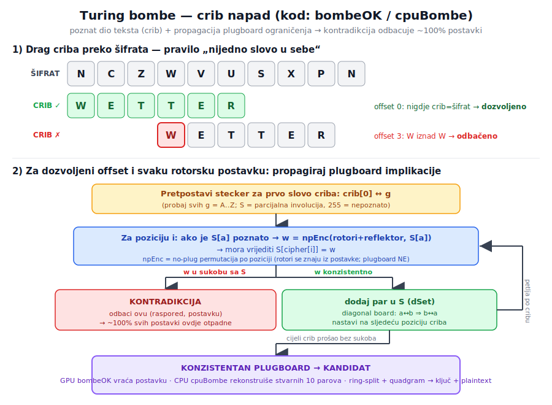

# Enigma M4 Breaker — istorija, kod, matematika

Referentni dokument koji povezuje **istorijske činjenice** o Enigmi M4 sa **tehnikama u ovom kodu**, definiše **šta se izvršava na CPU a šta na GPU**, i detaljno objašnjava **svaki pojam** (IoC, quadgram scoring, scoreXsplit, bombe, hill-climbing, depth…) uz **matematiku** i **linkove na izvore**.

> Napomena o autentičnosti: ožičenja, notch-evi, double-stepping i prolaz signala u ovom kodu su provjereni dekripcijom autentične poruke **U-264** (mora dati `VONVONJLOOKS...`). To je temelj — bez tačnog simulatora sve optimizacije su bezvrijedne.

---

## Sadržaj

1. [Istorijski uvod — Enigma M4](#1-istorijski-uvod--enigma-m4)
2. [Komponente mašine ↔ `EnigmaKey`](#2-komponente-mašine--enigmakey)
3. [Prostor ključeva — matematika](#3-prostor-ključeva--matematika)
4. [Podjela CPU ↔ GPU](#4-podjela-cpu--gpu)
5. [Statistički alati (svaki pojam u detalje)](#5-statistički-alati-svaki-pojam-u-detalje)
6. [Algoritmi napada (istorija + kod + matematika)](#6-algoritmi-napada-istorija--kod--matematika)
7. [Šta koji program radi](#7-šta-koji-program-radi)
8. [Ključni matematički nalaz projekta](#8-ključni-matematički-nalaz-projekta)
9. [Build & run referenca](#9-build--run-referenca)
10. [Mapa fajlova](#10-mapa-fajlova)
11. [Izvori / Further reading](#11-izvori--further-reading)

---

## 1. Istorijski uvod — Enigma M4

**Enigma M4** (njem. *Schlüssel M / Funkschlüssel M4*) je mornarička četvororotorska Enigma koju je Kriegsmarine uvela **1. februara 1942.** na atlantskoj U-boot mreži. Nijemci su je zvali **„Triton"**, saveznici **„Shark"**. Uvođenje je izazvalo *blackout iz 1942.* — oko 10 mjeseci tokom kojih Bletchley Park nije mogao čitati U-boot saobraćaj, u jeku Bitke za Atlantik.

Ključna novost u odnosu na tronotorsku M3 je **četvrti rotor**, ali poseban:

- Četvrti rotor je **tanki rotor** (*Zusatzwalze*) — **Beta** ili **Gamma** — koji se **NIKAD ne okreće** tokom šifrovanja.
- Uz njega ide **tanki reflektor** (*Umkehrwalze Dünn*): **B-thin** ili **C-thin**.
- **Dizajn radi kompatibilnosti (i slabost):** Beta na poziciji `A` + tanki reflektor B daju mašinu **funkcionalno identičnu** M3 sa standardnim UKW-B. Tako su M4 podmornice mogle komunicirati s M3 brodovima. Zato su baš ta ožičenja izabrana.

Preokret u razbijanju omogućila je **zaplijena kodnih knjiga sa U-559** (30.10.1942., HMS Petard) — kratki vremenski/signalni šifrarnik — što je dovelo do prvog probijanja M4 u decembru 1942.

**Izvori za ovu oblast:**
- Enigma (opšte): https://en.wikipedia.org/wiki/Enigma_machine
- Mornarička Enigma / M4 (najdetaljnije): https://www.cryptomuseum.com/crypto/enigma/m4/index.htm
- Kriptoanaliza Enigme: https://en.wikipedia.org/wiki/Cryptanalysis_of_the_Enigma
- Bitka za Atlantik: https://en.wikipedia.org/wiki/Battle_of_the_Atlantic
- Zaplijena sa U-559: https://en.wikipedia.org/wiki/German_submarine_U-559
- Bletchley Park / Tony Sale: http://www.codesandciphers.org.uk/

---

## 2. Komponente mašine ↔ `EnigmaKey`

Cijeli ključ je u [`config.h`](config.h) sažet u jednu strukturu:

```c
struct EnigmaKey {
    int rotor[4];      // [0]=thin(Beta/Gamma), [1]=lijevi, [2]=srednji, [3]=desni
    int ring[4];       // Ringstellung
    int position[4];   // Grundstellung (početna pozicija)
    int reflector;     // B-thin / C-thin
    int plugboard[26]; // Steckerbrett (plug[i]=i => slovo i nije steckerovano)
};
```

### Tok signala kroz mašinu



Putanja jednog znaka: `ULAZ → plugboard → desni → srednji → lijevi → thin → REFLEKTOR → thin → lijevi → srednji → desni → plugboard → IZLAZ`. U kodu je to `EnigmaCPU::encryptChar()` (CPU) odnosno `gEnc()` (GPU). Pošto je reflektor involucija, putanja je **recipročna** — ista mašina i šifruje i dešifruje.

### Rotori, ožičenja, notch
`config.h` sadrži **istorijska ožičenja** rotora I–VIII, tankih rotora Beta/Gamma i reflektora B/C-thin:

- Rotori **I–V** (1930-e, dijelili Wehrmacht i Kriegsmarine) imaju **jedan** notch (I=`Q`, II=`E`, III=`V`, IV=`J`, V=`Z`).
- Rotori **VI, VII, VIII** (mornarički-only, 1939) imaju **dva** notcha (`Z` i `M`) → `ROTOR_NOTCH[5..7]="ZM"`. Dva zareza okreću srednji rotor dvaput češće (dodatna zaštita).
- Notch slovo je tačka na kojoj rotor „povlači" sljedeći — istorijski ugravirano na prstenu.

**Izvori:**
- Ožičenja svih rotora/reflektora (referenca s kojom se kod poklapa): https://www.cryptomuseum.com/crypto/enigma/wiring.htm
- Detalji rotora i turnover/notch: https://en.wikipedia.org/wiki/Enigma_rotor_details

### Thin rotor (Beta/Gamma) + thin reflector
`THIN_ROTOR_WIRING[2]`, `REFLECTOR_WIRING[2]`. U kodu je thin rotor u **slotu 0** i u `EnigmaCPU::step()` se nikad ne koraka; njegov prsten je efektivno uvijek 0. Istorijski razlog (M3 kompatibilnost) opisan u sekciji 1.
- Objašnjenje thin reflektora: https://www.cryptomuseum.com/crypto/enigma/wiring.htm

### Ringstellung (`ring`) — postavka prstena
Prsten s abecedom rotiran u odnosu na unutrašnje ožičenje; pomjera relaciju pozicija↔ožičenje. U [`enigma_cpu.cpp`](core/enigma_cpu/enigma_cpu.cpp):
```c
int off = (pos[slot] - ring[slot] + 26) % 26;   // srce tačnosti — predznak je kritičan
c = (c + off) % 26;  c = fw[slot][c];  c = (c - off + 26) % 26;
```
- https://en.wikipedia.org/wiki/Enigma_rotor_details

### Grundstellung (`position`) — početna pozicija
Vidljiva slova u prozorčićima na početku. Istorijski: operater postavi osnovnu poziciju pa šifruje *message key*. U U-264: `VJNA`.

### Steckerbrett (`plugboard`) — utični panel
Par kablova zamijeni dva slova prije i poslije rotora. Kriegsmarine: tipično **10 parova**. Najveći doprinos prostoru ključeva (vidi sekciju 3) i razlog zašto se mora *vraćati statistički*. U kodu je involucija: par (a,b) ⇒ `plug[a]=b, plug[b]=a`.
- https://en.wikipedia.org/wiki/Enigma_machine#Plugboard

### Double-stepping (anomalija dvostrukog koraka)
Zbog mehanizma palica/zupčanika (*pawl-and-ratchet*), kad je srednji rotor na svom zarezu, pri sljedećem pritisku korakne **i sam sebe i lijevi** rotor. Mehanički artefakt, ne dizajn; najčešća greška simulatora. U [`enigma_cpu.cpp`](core/enigma_cpu/enigma_cpu.cpp):
```c
void EnigmaCPU::step() {
    bool right_at_notch = at_notch[3][pos[3]];
    bool mid_at_notch   = at_notch[2][pos[2]];
    if (mid_at_notch)        { pos[1]++; pos[2]++; }  // dvostruki korak
    else if (right_at_notch) { pos[2]++; }
    pos[3]++;                                         // desni uvijek; thin nikad
}
```
Provjera je **prije** rotacije.
- Objašnjenje: https://en.wikipedia.org/wiki/Enigma_rotor_details#Normalized_Enigma_sequences
- Klasik: David H. Hamer, *„Enigma: Actions Involved in the 'Double Stepping' of the Middle Rotor"*, Cryptologia 21(1), 1997. PDF: https://www.tandfonline.com/doi/abs/10.1080/0161-119791885896

### Recipročnost / „nijedno slovo u sebe"
Reflektor je involucija bez fiksnih tačaka ⇒ cijela mašina je recipročna i **nijedno slovo se ne šifruje u samo sebe**. Najveća slabost Enigme i temelj bombe/crib napada (sekcija 6.2). U kodu: `sanityCipher()` i clash-provjera pri drag-u criba.

---

## 3. Prostor ključeva — matematika

| Komponenta | Broj | Račun |
|---|---|---|
| Raspored rotora (wheel order) | **1344** | 8·7·6 (3 od 8, uređeno) × 2 (Beta/Gamma) × 2 (refl B/C) |
| Početne pozicije (Grundstellung) | **456 976** | 26⁴ |
| Postavke prstena (efektivno) | **17 576** | 26³ (thin prsten irelevantan) |
| Plugboard, 10 parova | **≈ 1,5 × 10¹⁴** | 26! / (6! · 2¹⁰ · 10!) |

**Plugboard formula** (za *p* parova od 26 slova):

```
N_plug(p) = 26! / ( (26 - 2p)! · 2^p · p! )
N_plug(10) = 150 738 274 937 250  ≈ 1,5 × 10^14
```

Ukupni prostor M4 je reda **~10²³**.

**Posljedica (cijela filozofija koda):**
- Rotorski dio (1344 × 26⁴ × 26³ ≈ **3 × 10¹⁰**) je **brute-force izvodljiv na GPU**.
- Plugboard (10¹⁴) **nije** — mora se *vraćati* hill-climbingom ili bombe napadom.

Zato se prostor *cijepa*: GPU prečešlja rotore/pozicije jeftinim skorom; skupi plugboard se rješava samo na nekoliko stotina preživjelih kandidata na CPU.

**Degeneracija prsten↔pozicija:** za jednu poruku, prsten desnog rotora i početna pozicija su gotovo zamjenjivi (osim oko notcha). Kod to prihvata za kratke poruke.

**Izvori:**
- Broj postavki Enigme (uklj. plugboard izvod): https://en.wikipedia.org/wiki/Enigma_machine#Mathematical_analysis
- Detaljan izvod plugboard kombinatorike: https://en.wikipedia.org/wiki/Enigma_machine#Mathematical_analysis (sekcija o broju ključeva)

---

## 4. Podjela CPU ↔ GPU

Centralni inženjerski princip: **„drži milione na GPU, prebaci samo top 20–100 na CPU".**



### Na GPU (`__global__` / `__device__`)
1. **Masivno paralelna pretraga** — jedan thread = jedna pozicija (26⁴), ili jedan thread = jedna (pozicija × prsten) postavka za bombe. Threadovi nezavisni → idealno za GPU.
2. **Enigma dekripcija po threadu** — `gEnc()` (isto jezgro kao CPU, ali `__forceinline__` + constant memorija).
3. **Jeftin skor + plugboard mini-HC koji stane u registre** — IoC (`decIoC`+`iocPlugHC`) ili trigram (`triHC_direct`).
4. **Turing bombe** (`bombeKernel`/`bombeOK`).
5. **Redukcija po bloku** — block-max preko shared memorije (stablo redukcija) ili warp shuffle `__shfl_down_sync`.
6. **Memorija:** ožičenja → `__constant__` (<4 KB, broadcast); trigram tabela (70 KB) → `__device__` global (staje u L2 keš); quadgram (1,8 MB) → global.

### Na CPU (host)
1. **Učitavanje** quadgram/trigram tabela i šifrata; **upload** ožičenja na GPU.
2. **Orkestracija** — petlja po 1344 rasporeda, lansiranje kernela, kopiranje block-maxima.
3. **Izbor top-N** (`std::partial_sort`, `std::sort`).
4. **Skupo precizno finalno skorovanje** — pun quadgram hill-climb (`hillClimb`) sa steepest-ascent + restartima + 2-opt, **samo na top-N**.
5. **Tačan simulator** (`EnigmaCPU`) za verifikaciju i plaintext.
6. **CPU ogledalo bombe** (`cpuBombe`) za vraćanje stvarnog plugboarda; `xSolve`/`covHillClimb`; `jointHillClimb` za depth.

**Zašto baš ovako:** GPU je sjajan za *neuredno-paralelan grubi filter* (milijarde jeftinih nezavisnih evaluacija, mala memorija po threadu). CPU je bolji za *grananjem bogato, precizno dorađivanje* na nekoliko stotina preživjelih.

**Izvori (CUDA tehnike):**
- CUDA C++ Programming Guide: https://docs.nvidia.com/cuda/cuda-c-programming-guide/
- Constant & shared memorija: https://developer.nvidia.com/blog/using-shared-memory-cuda-cc/
- Warp-level primitivi (`__shfl_down_sync`): https://developer.nvidia.com/blog/using-cuda-warp-level-primitives/
- Mark Harris, *Optimizing Parallel Reduction in CUDA* (block redukcija): https://developer.download.nvidia.com/assets/cuda/files/reduction.pdf

---

## 5. Statistički alati (svaki pojam u detalje)

### 5.1 Index of Coincidence (IoC)

**Istorija:** uveo **William F. Friedman, 1922** (*„The Index of Coincidence and Its Applications in Cryptography"*) — temelj moderne kriptoanalize.

**Definicija** (vjerovatnoća da dva nasumična slova budu ista):

```
IoC = Σ f_i (f_i - 1) / ( N (N-1) )      (i = A..Z), N = dužina teksta
```

**Očekivane vrijednosti:**
- Slučajan tekst: 1/26 = **0,0385**
- Engleska proza: ~0,0667
- Njemačka proza: ~**0,0762** (= Σ pᵢ²)
- Njemački mornarički tekst (brojevi, X-markeri): ~**0,057** (nije proza)

**Zašto radi:** smislen jezik ima neravnomjerne frekvencije → veći IoC; pogrešna dekripcija → pseudo-slučajno → IoC ≈ 0,0385. Bez parametara i jeftin (samo brojanje) → idealan prvi filter. U kodu: `decIoC` (GPU), `iocScore` (CPU). Kalibrisani pragovi: **0,042** bez plugboarda, **0,030** sa ≥5 parova.

**Izvori:**
- https://en.wikipedia.org/wiki/Index_of_coincidence
- Tutorial + kod: https://www.dcode.fr/index-coincidence
- Friedman 1922 (originalna monografija, skenirano): https://www.britannica.com/topic/The-Index-of-Coincidence-and-Its-Applications-in-Cryptography

### 5.2 Trigram / quadgram log-vjerovatnoća

**Ideja:** vjerovatnoća **slijedova od 3 (trigram) / 4 (quadgram) slova**, iz velikog njemačkog korpusa (`data/german_quadgrams.txt`: 291 654; `data/german_trigrams.txt`: 17 142).

**Matematika (zašto logaritam):** skor teksta je proizvod vjerovatnoća svih prozora; proizvod mnogo malih brojeva → underflow. Zato suma logaritama:

```
S = Σ_k log10( P(gram_k) )      (negativan; traži se MAKSIMUM)
```

**Floor za neviđene grame** (da jedan log(0) = −∞ ne uništi skor) — [`enigma_breaker.cu`](enigma_breaker.cu):
```c
double floor_v = log10(0.01/tot);
out[i] = cnt[i]>0 ? log10(cnt[i]/tot) : floor_v;
```

**Trigram vs quadgram:** quadgram je oštriji diskriminator ali veći i osjetljiviji na kratke poruke; trigram je gušći/robusniji. Zato: **trigram na GPU** (brzo, 70 KB), **quadgram na CPU** (precizno). Referenca: tačan njemački tekst ≈ **−5,6/znak** (quadgram); gibberish < −6,7.

**Izvori:**
- Quadgram statistika i fitness funkcija: https://en.wikipedia.org/wiki/N-gram
- Razbijanje Enigme n-gramima (kraj-do-kraj primjer): https://www.bytereef.org/m4_project.html
- Izvor tabela u ovom projektu (`torognes/enigma`): https://github.com/torognes/enigma
- Heidi Williams, *Applying Statistical Language Recognition Techniques in the Ciphertext-only Cryptanalysis of Enigma*, Cryptologia 24(1), 2000: https://www.tandfonline.com/doi/abs/10.1080/0161-110091888745

### 5.3 `scoreXsplit` — quadgram po X-segmentima

**Istorijska činjenica:** njemački operateri koristili su slovo **`X` kao razmak/tačku** i sricali interpunkciju/brojeve (npr. `VONXOBERKOMMANDOXDERXMARINE`, brojevi `EINS ZWO DREI`). Otud `X` razdvaja stvarne riječi.

**Kod** ([`enigma_crib_solver.cu`](enigma_crib_solver.cu)):
```c
static float scoreXsplit(const std::string& p, const QuadgramScorer& qg){
    float s=0.f; size_t i=0,n=p.size();
    while(i<n){
        size_t j=i; while(j<n && p[j]!='X') j++;  // do sljedećeg X
        if(j-i>=4) s+=qg.score(p.substr(i,j-i));   // skoruj SAMO segment između X-ova
        i=j+1;
    }
    return s;
}
```
**Kako radi:** dijeli plaintext na svakom `X`, skoruje quadgramom samo segmente ≥4, sabira.

**Zašto je bolje od skora cijelog teksta:** čist quadgram nad cijelim tekstom ima **X-bias** — hill-climb rado uvede lažni `X↔A` stecker da „očisti" X-ove i naduva skor, čime razbije ispravnu dekripciju. `scoreXsplit` nagrađuje **ispravnu segmentaciju** i ignoriše X-ove → nema bias. `scoreXsplitTri` radi isto s trigramima i pragom ≥3 (robusnije na kratkim porukama).

**Izvori:**
- Procedure i format poruka (X, sricanje): https://www.cryptomuseum.com/crypto/enigma/m4/index.htm
- https://en.wikipedia.org/wiki/Enigma_machine#Operation

### 5.4 `phraseCoverage` — matched language model
```c
// udio slova plaintexta pokrivenih nekom od 26 poznatih fraza kao podniskom
```
**Šta je:** za sintetičke test-poruke (sastavljene baš od tih fraza) tačna dekripcija → coverage ≈ 1,0. **Ograničenje:** *matched* model — radi samo na test-korpusu; za prave poruke (sadržaj nepoznat) je beskorisno. Koristi se kao cilj `covHillClimb` jer daje glatki gradijent ka tačnom plugboardu.

### 5.5 `FastEval` — matematička optimizacija dekripcije
**Uvid:** rotor+reflektor permutacija **po poziciji** je **nezavisna od plugboarda**:

```
c -> plug[ P_i[ plug[c] ] ]      (P_i = no-plug permutacija na poziciji i)
```

**Šta radi:** predračuna `P_i[x]` za svaku poziciju (N×26) **jednom po ključu**; potom je svaka dekripcija samo O(N) lookup-ova umjesto ~8 rotor-prolaza po znaku. Pošto hill-climb radi stotine evaluacija po ključu, ovo ga ubrza višestruko. Pretpostavka: thin/left prsten = 0.

---

## 6. Algoritmi napada (istorija + kod + matematika)

### 6.1 Plugboard hill-climbing
**Šta je:** lokalna optimizacija — od stanja, probaj sve „susjede", pređi na najbolji koji poboljšava skor, ponavljaj. **Steepest ascent** = biraj najbolji susjed (ne prvi bolji).

**Problem:** lokalni maksimum. Rješenje u [`plugboard_hc.h`](search/plugboard_search/plugboard_hc.h):
- **Restarti** (30) iz nasumičnih početnih stanja → uzmi globalno najbolji.
- **Operacije:** add / remove / swap kraja / replace para.
- **2-opt post-refinement** (`twoOptRefine`): mijenja **dva para istovremeno** (4 slova) — bježi iz maksimuma koje single-swap ne može; izvodi se kao post-processing (ne u glavnoj petlji).

**Izvori:**
- Hill climbing: https://en.wikipedia.org/wiki/Hill_climbing
- 2-opt: https://en.wikipedia.org/wiki/2-opt
- Simulated annealing (alternativa): https://en.wikipedia.org/wiki/Simulated_annealing
- Primjena na Enigmu (hill-climb plugboard): https://www.bytereef.org/m4_project.html

### 6.2 Turing bombe (`bombeOK` / `cpuBombe`)
**Istorija:** Poljaci (**Marian Rejewski**, 1938) → *bomba kryptologiczna*. **Alan Turing** redizajnirao za napad zasnovan na *cribu*; **Gordon Welchman** dodao **diagonal board** (drastično ubrzanje). Prva bombe „Victory", mart 1940.

**Princip:** iskoristi recipročnost da *dragguješ* crib preko šifrata samo gdje nema sudara slova; za svaku rotorsku postavku **propagiraj plugboard implikacije**; ako se pojavi **kontradikcija** → postavka nemoguća (~100% otpadne).



**Kod** ([`enigma_crib_solver.cu`](enigma_crib_solver.cu)):
```c
__device__ bool bombeOK(...) {
    for(int g=0; g<26; g++){          // pretpostavka steckera prvog slova criba
        unsigned char S[26]; ...      // parcijalna involucija (255 = nepoznato)
        if(!dSet(S, crib[0], g)) continue;
        // za svako i: ako znamo S[a], izračunaj kuda ide kroz rotore (npEnc) -> mora biti S[b];
        // ako S[b] već postavljen i ne slaže se -> kontradikcija (bad)
        while(changed && !bad){ ... }
        if(!bad) return true;          // postoji konzistentan plugboard
    }
    return false;
}
```
- `dSet` postavlja par u S; vraća false na kontradikciju — softverski ekvivalent Welchmanovog diagonal board-a (a↔b povlači b↔a).
- `npEnc` = no-plug permutacija (rotori+reflektor) — što fizička bombe radi rotorima.
- Pretraga: **26⁵** (standard) ili **26⁶** u R6 modu (turnover-aware srednji ring; ~309M, ~26× sporije, ~100% tačno).
- `cpuBombe` na preživjelom kandidatu **vrati stvarnih 10 parova**.

**Izvori:**
- Bombe (mašina i logika): https://en.wikipedia.org/wiki/Bombe
- Diagonal board / Welchman: https://en.wikipedia.org/wiki/Bombe#The_principle_of_the_bombe
- Animirano objašnjenje (Graham Ellsbury): https://en.wikipedia.org/wiki/Bombe#The_principle_of_the_bombe
- Crib / known-plaintext: https://en.wikipedia.org/wiki/Known-plaintext_attack
- Rejewski i poljska bomba: https://en.wikipedia.org/wiki/Cryptologic_bomb

### 6.3 Gillogly ciphertext-only napad
**Istorija:** **Jim Gillogly, *„Ciphertext-only Cryptanalysis of Enigma"*, Cryptologia 19(4), 1995** — Enigma se može razbiti **bez criba**: prvo nađi rotorske postavke maksimizujući IoC/n-gram, pa hill-climbom vrati plugboard.

**U kodu, dva oblika:**
- `triHC_direct` ([`enigma_breaker.cu`](enigma_breaker.cu)): po poziciji dekriptuje sve znakove pa radi 3-pass trigram hill-climb prateći `plug[]` i **streaming trigram-deltu** (samo razlika skora pri swapu, O(N)). Trigram jer je njemačka trigram distribucija iskošenija (DER/EIN/UND) → bolji SNR.
- `iocPlugHC` ([`crack_u264.cu`](crack_u264.cu), [`enigma_blind.cu`](enigma_blind.cu)): isto, ali skor je **IoC s plugboardom na obje strane**, ADD-only do 10 parova; prvi pass probava svih 325 parova (bijeg s ravnog no-plug platoa).

**Izvori:**
- Gillogly 1995 (Cryptologia): https://www.tandfonline.com/doi/abs/10.1080/0161-119591883944
- Pregled ciphertext-only pristupa: https://www.bytereef.org/m4_project.html

### 6.4 Depth napad (`jointHillClimb`)
**Istorija:** **„depth"** = više poruka istim dnevnim ključem (razlika samo u poziciji). Bletchley to masovno koristio; **Banburismus** (Turing) je sekvencijalna Bayesovska procedura (mjereno u *banovima/decibanima*) koja iz depth-a sužava kandidate za rotore.

**Matematika** ([`enigma_blind_depth.cu`](enigma_blind_depth.cu)): single-message blind pada jer plugboard HC **overfituje** (lažni stecker naduva IoC na jednoj poruci). Depth skoruje kandidata kao **SUMU preko poruka**:

```
S_joint(plug) = Σ_m  qg( dekript(m, plug) )
```

Lažni stecker koji pomaže poruci 1 **šteti** poruci 2 → zajednički plugboard **forsira PRAVI ključ**, a signal raste s ukupnom dužinom. Zato depth radi a single-message ne.

**Izvori:**
- Banburismus: https://en.wikipedia.org/wiki/Banburismus
- Ban (jedinica informacije): https://en.wikipedia.org/wiki/Ban_(unit)
- Depth (kriptoanaliza): https://en.wikipedia.org/wiki/Cryptanalysis_of_the_Lorenz_cipher

---

## 7. Šta koji program radi

| Program | Pretpostavka napadača | Pipeline (GPU → CPU) | Istorijska paralela |
|---|---|---|---|
| [`enigma_breaker.cu`](enigma_breaker.cu) | samo šifrat, 1 poruka | GPU: Stage A triHC po 1344×26⁴ → ring sweep 26³. CPU: quadgram HC na top-50 | Gillogly 1995 |
| [`crack_u264.cu`](crack_u264.cu) | poznat dnevni ključ (key sheet) | GPU: 26⁴ pozicija × IoC-plug-HC. CPU: quadgram HC na top-256 | čitanje uz poznat dnevni ključ |
| [`enigma_blind.cu`](enigma_blind.cu) | samo šifrat, slijepo | GPU: 1344×26⁴ × IoC-plug-HC. CPU: quadgram HC na global top-N | Gillogly, pun sweep |
| [`enigma_blind_depth.cu`](enigma_blind_depth.cu) | više poruka isti ključ | GPU: po poruci nađi poziciju. CPU: zajednički plugboard (joint HC) | depth / Banburismus |
| [`enigma_crib_solver.cu`](enigma_crib_solver.cu) | poznat crib | GPU: bombe 26⁵/26⁶. CPU: vrati plug (cpuBombe) + xSolve + ring split | Turing/Welchman bombe |

**KORAK 0 — verifikacija (CPU):** [`enigma_cpu.cpp`](core/enigma_cpu/enigma_cpu.cpp) mora dekriptovati autentičnu **U-264** (Beta II IV I, B-thin, ring 01 01 01 22, ključ VJNA, 10 plug parova) u `VONVONJLOOKS...`. „von von Looks" = potpis Kptlt. **Hartwiga Looksa**, komandanta U-264 (poruka iz nov. 1942).

**Izvori:**
- M4 Project (distribuirano razbijanje 3 autentične M4 poruke, Stefan Krah): https://www.bytereef.org/m4_project.html
- Originalne presretnute M4 poruke iz 1942: https://www.bytereef.org/m4_project.html (sekcija „messages")

---

## 8. Ključni matematički nalaz projekta

Najvažniji rezultat (dokumentovan u [`crack_u264.cu`](crack_u264.cu)):

> Dekripcija na **tačnom** ključu ali **bez plugboarda** je za poruku s 10 parova **statistički nerazlučiva od slučajnog teksta** (IoC 0,040 ≈ random 0,0385).

**Zašto:** no-plug dekripcija nije `P(plaintext)` nego `M_i ∘ P ∘ M_i ∘ P(plaintext)` — gdje je `P` stvarni plugboard koji nedostaje s obje strane, a `M_i` rotorska permutacija koja se mijenja sa svakim znakom. To „razmaže" signal u pseudo-slučajno.

**Posljedica:** jedini diskriminator za teške plugboarde je **stvarno vraćanje plugboarda na obje strane** (`iocPlugHC` / `cpuBombe`), ne skorovanje no-plug izlaza. Zato Stage A glavnog breakera *po dizajnu* ne nalazi tačan ključ u top-100 za 10 parova — vraća top-1000+ koje plugboard faza prečisti. **To nije bug nego matematička granica.**

---

## 9. Build & run referenca

Okruženje (provjereno): RTX 4080 SUPER (CC 8.9), CUDA 12.4, MSVC 14.44, native VS ninja.

**CUDA `.exe` (direktno nvcc):**
```bat
call "...\VC\Auxiliary\Build\vcvars64.bat"
nvcc -ccbin "...\14.44.35207\bin\Hostx64\x64\cl.exe" ^
     -std=c++17 -arch=sm_89 -O3 --use_fast_math -I. ^
     -o build\output.exe core\enigma_gpu\source.cu
```

Build skripte u repou:
- [`build.bat`](build.bat) — objedinjen build svih attack alata (targeti `crack`,
  `crib`, `depth`, `blind`, `breaker`, `diag`)
- [`build.ps1`](build.ps1) — CMake/Ninja build jezgra
  (`verify_r1`/`verify_r2`/`verify_r3`)

Verifikacija jezgra (CPU): `build\verify_r1.exe` (round-trip + U-264), `build\verify_r2.exe data` (IoC/trigram/quadgram).

> Napomena: `extern __constant__` u headeru + definicija u `.cu` daje C2086 grešku; zato je svaki `.exe` self-contained (jezgro je kopirano u svaki `.cu`). Cijena je duplikacija koda.

---

## 10. Mapa fajlova

```
config.h                              Ožičenja, notch, EnigmaKey
core/enigma_cpu/enigma_cpu.{h,cpp}    Verifikovani CPU M4 simulator (KORAK 0)
core/enigma_gpu/brute_r3..r6.cu       Razvojne faze GPU kernela (IoC, multi-filter, top-N, ring)
filters/ioc, trigram, quadgram        CPU scoreri
search/plugboard_search/plugboard_hc.h  CPU plugboard hill-climb (steepest+restart+2opt)
enigma_breaker.cu                     Glavni: Gillogly triHC + ring + quadgram HC
crack_u264.cu                         Full-plugboard IoC-HC (poznat dnevni ključ)
enigma_blind.cu                       Ciphertext-only, sweep 1344 rasporeda
enigma_blind_depth.cu                 Depth (više poruka isti ključ, zajednički plugboard)
enigma_crib_solver.cu                 GPU Turing bombe (poznat crib), R6 turnover-aware
data/german_{quadgrams,trigrams}.txt  Korpusne tabele frekvencija
```

---

## 11. Izvori / Further reading

> Linkovi provjereni (jun 2026). Akademski radovi na `tandfonline.com` (Gillogly, Williams, Hamer) **rezolvuju ali su iza paywall-a** — apstrakt je javan, pun tekst preko biblioteke / Google Scholar. Originalni Friedman 1922. nije javno digitalizovan (link vodi na Britannica opis publikacije).

**Istorija i mašina**
- Enigma (opšte): https://en.wikipedia.org/wiki/Enigma_machine
- Enigma M4 (Crypto Museum): https://www.cryptomuseum.com/crypto/enigma/m4/index.htm
- Ožičenja rotora/reflektora: https://www.cryptomuseum.com/crypto/enigma/wiring.htm
- Detalji rotora / turnover / double-step: https://en.wikipedia.org/wiki/Enigma_rotor_details
- Kriptoanaliza Enigme: https://en.wikipedia.org/wiki/Cryptanalysis_of_the_Enigma
- Bitka za Atlantik: https://en.wikipedia.org/wiki/Battle_of_the_Atlantic
- Zaplijena U-559: https://en.wikipedia.org/wiki/German_submarine_U-559
- Bletchley Park (Tony Sale): http://www.codesandciphers.org.uk/

**Matematika i statistika**
- Index of Coincidence: https://en.wikipedia.org/wiki/Index_of_coincidence
- IoC tutorial + kod: https://www.dcode.fr/index-coincidence
- Friedman 1922 (originalna monografija): https://www.britannica.com/topic/The-Index-of-Coincidence-and-Its-Applications-in-Cryptography
- Quadgram statistika: https://en.wikipedia.org/wiki/N-gram
- Broj postavki Enigme: https://en.wikipedia.org/wiki/Enigma_machine#Mathematical_analysis

**Algoritmi napada**
- Razbijanje Enigme (kraj-do-kraj, n-gram + hill-climb): https://www.bytereef.org/m4_project.html
- Gillogly 1995 (ciphertext-only): https://www.tandfonline.com/doi/abs/10.1080/0161-119591883944
- Williams 2000 (statistički jezički model): https://www.tandfonline.com/doi/abs/10.1080/0161-110091888745
- Bombe: https://en.wikipedia.org/wiki/Bombe
- Bombe — animirano: https://en.wikipedia.org/wiki/Bombe#The_principle_of_the_bombe
- Banburismus: https://en.wikipedia.org/wiki/Banburismus
- Hill climbing: https://en.wikipedia.org/wiki/Hill_climbing
- 2-opt: https://en.wikipedia.org/wiki/2-opt

**GPU / CUDA**
- CUDA C++ Programming Guide: https://docs.nvidia.com/cuda/cuda-c-programming-guide/
- Shared memorija: https://developer.nvidia.com/blog/using-shared-memory-cuda-cc/
- Warp-level primitivi: https://developer.nvidia.com/blog/using-cuda-warp-level-primitives/
- Parallel reduction (Mark Harris): https://developer.download.nvidia.com/assets/cuda/files/reduction.pdf

**Praktično / projekti**
- M4 Project (Stefan Krah, distribuirano razbijanje): https://www.bytereef.org/m4_project.html
- Izvor korpusnih tabela (torognes/enigma): https://github.com/torognes/enigma
- Online Enigma simulator (za eksperimente): https://www.boxentriq.com/ciphers/enigma-machine

---

*Dokument generisan kao referenca uz izvorni kod. Pojmovi, formule i linkovi vezani su za konkretne fajlove i funkcije u ovom repou.*
