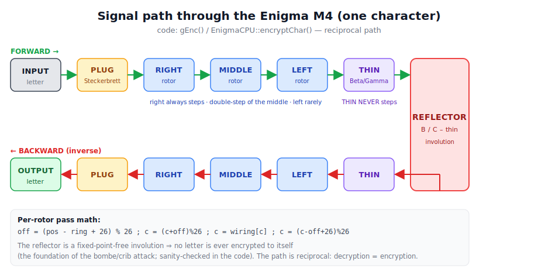
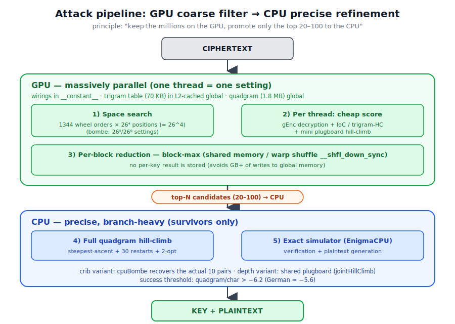
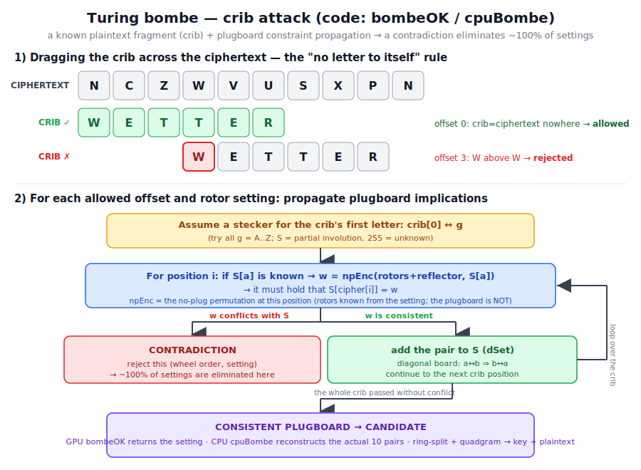

# Enigma M4 Breaker

GPU-accelerated cryptanalysis suite (C++ / CUDA, Windows) that breaks the German naval
**Enigma M4** cipher - the 4-rotor "Shark"/"Triton" machine used by the Kriegsmarine
U-boat fleet from 1942. On a single modern GPU it reproduces the historical attacks
Bletchley Park used against U-boat traffic: crib-dragging (Turing bombe), depth attacks,
and full-plugboard hill-climbing.

> Za verziju ovog README-a vidi [README_BHS.md](README_BHS.md).

The wiring, notch stepping, and double-stepping anomaly are verified against the
authentic historical **U-264** message (25 Nov 1942), which this code decrypts to
`VONVONJLOOKS…` - the same result as the *M4 Project* (Stefan Krah, 2006).

## Why this exists

Enigma M4's keyspace is roughly **10²³**. Most of that space (rotor order × positions ×
rings, ≈ 3×10¹⁰) is cheap enough to brute-force on a GPU. The plugboard
(10 pairs ≈ 1.5×10¹⁴ combinations) is not - it has to be *recovered statistically* via
hill-climbing, exactly as the historical bombe did with electromechanical logic instead
of CUDA cores. This project splits the problem the same way: GPU sweeps the cheap part,
CPU hill-climbs the plugboard on the survivors.

## What it breaks

| Component | Count | Notes |
|---|---|---|
| Wheel order | 1344 | 3 of 8 rotors (ordered) × 2 Greek rotors (Beta/Gamma) × 2 reflectors (B/C-thin) |
| Start positions (Grundstellung) | 456 976 | 26⁴ |
| Ring settings (effective) | 17 576 | 26³ (thin rotor's ring is irrelevant) |
| Plugboard, 10 pairs | ≈ 1.5 × 10¹⁴ | `26! / ((26-2p)! · 2^p · p!)`, p=10 |

## Attack tools

| Tool | Scenario | Needs | Recovers |
|---|---|---|---|
| `crack_u264` | Daily key already known (e.g. captured key sheet) | Wheel order + rings | Message position + full plugboard |
| `enigma_crib_solver` | Known/guessed plaintext fragment (crib) | A crib ≥ ~20 letters | Full key (GPU Turing-bombe) |
| `enigma_blind_depth` | A day's traffic sharing one daily key | Several messages, rings | Wheel order + plugboard |
| `enigma_blind` | Single message, nothing known | - | Does not work reliably (see [MANUAL_EN.md](MANUAL_EN.md)) |
| `enigma_breaker` | Ciphertext-only via cheap heuristic | - | Old/legacy - kept for reference |

Why single-message blind fails but the others work: a no-plugboard decryption of the
correct key has an Index of Coincidence ≈ 0.040 - indistinguishable from random text.
No cheap statistic can find the right key from ciphertext alone; the signal only
appears once the plugboard is (partially) recovered. Full technical detail, math, and
sources: [DOCUMENTATION.md](DOCUMENTATION.md) (English, most complete; Serbian version:
[DOKUMENTACIJA_BHS.md](DOKUMENTACIJA_BHS.md)) and [MANUAL_EN.md](MANUAL_EN.md).

## Diagrams

**Signal path** - one keypress, one full pass through the machine:
plugboard → right → middle → left → thin rotor → reflector → back out through the same
rotors → plugboard. The reflector is a fixed-point-free involution, so the path is
reciprocal (the same machine encrypts and decrypts) and no letter is ever enciphered to
itself - the crack in Enigma's armor that the bombe/crib attack exploits.



**Attack pipeline** - the central engineering idea of this project: the GPU sweeps
millions of cheap rotor/position candidates in parallel (IoC or trigram score), and only
the top 20–100 survivors are promoted to the CPU for expensive, precise quadgram
hill-climbing and full plugboard recovery.



**Turing bombe / crib attack** - how `enigma_crib_solver` recovers a key from a known
plaintext fragment: drag the crib across the ciphertext (skipping offsets where a letter
would map to itself), then for each surviving offset and rotor setting, propagate
plugboard implications until either a contradiction eliminates the setting or the whole
crib passes - leaving a consistent plugboard candidate.



## Repository layout

```
config.h                 Rotor/reflector wirings, notches, EnigmaKey struct
core/enigma_cpu/          Verified CPU M4 simulator (ground truth)
core/enigma_gpu/          GPU kernel development phases (IoC -> multi-filter -> ring search)
filters/                  CPU scorers: Index of Coincidence, trigram, quadgram
search/plugboard_search/  CPU plugboard hill-climb (steepest-ascent + restarts)
crack_u264.cu             Attack tool: known daily key -> message key + plugboard
enigma_crib_solver.cu     Attack tool: crib-dragging GPU Turing-bombe
enigma_blind_depth.cu     Attack tool: depth (shared daily key across messages)
enigma_blind.cu           Attack tool: single-message ciphertext-only (unreliable)
enigma_breaker.cu         Legacy ciphertext-only breaker (reference only)
ioc_diag.cpp              Diagnostic: IoC of U-264 with/without plugboard
data/                     German quadgram/trigram frequency tables + U-264 ciphertext
tests/test_messages/      420 synthetic test messages + the authentic U-264 message
tests/test_messages_day1/2/3/  Depth corpora: one day's traffic sharing a daily key
diagram_*.svg             Signal path / attack pipeline / bombe diagrams (English)
dijagram_*.svg            Same diagrams, Serbian labels (used by DOKUMENTACIJA_BHS.md)
build.bat                 Compiles the attack tools (cl.exe + nvcc)
build.ps1                 Compiles the CMake/Ninja core pipeline (verify_r1..r3)
CMakeLists.txt            CMake project for the core simulator/scoring/GPU-kernel tests
```

## Requirements

| Component | Version used | Notes |
|---|---|---|
| GPU | NVIDIA, Compute Capability ≥ 6.0 (tested: RTX 4080 SUPER, CC 8.9) | CUDA-capable |
| CUDA Toolkit | 12.4 | provides `nvcc`; must be on `PATH` |
| Host C++ compiler | MSVC 14.4x (Visual Studio 2022 or newer) | CUDA 12.4 requires MSVC ≤ 14.4x |
| OS | Windows 10/11 x64 | |

## Building

```
git clone <this-repo>
cd EnigmaM4Breaker

REM attack tools (crack_u264, enigma_crib_solver, enigma_blind_depth, ...)
build.bat

REM core pipeline (verify_r1, verify_r2, verify_r3) via CMake/Ninja
powershell -File build.ps1
```

Both scripts locate the repo from their own path - no absolute-path editing needed to
just build. If your Visual Studio/MSVC install differs from the defaults, override with
environment variables (`build.bat`) or `-VsDir` (`build.ps1`) - see the top of each
script, or [MANUAL_EN.md § Compilation & Installation](MANUAL_EN.md#part-v--compilation--installation)
for the full walkthrough and troubleshooting.

## Usage examples

Run every tool from the repository root (the folder containing `build.bat`); each
prints a wall-clock elapsed time at the end.

**1) `crack_u264`** - break a message given the known daily rotor key:
```
build\crack_u264.exe data
REM Expected: message key VJNA, plugboard AT BL DF GJ HM NW OP QY RZ VX,
REM           plaintext VONVONJLOOKS..., ~4 min on an RTX 4080-class GPU.
```

**2) `enigma_crib_solver`** - blind crib + Turing-bombe attack:
```
REM Full blind solve, sweeping all 1344 wheel orders:
build\enigma_crib_solver.exe data msg.txt 0 1344

REM Quick check on a single known wheel order (index 79):
build\enigma_crib_solver.exe data msg.txt 79 1

REM Real message, unknown content - drag a dictionary of German cribs across it:
build\enigma_crib_solver.exe data msg.txt 0 1344 DICT
```
Expected: `=== SOLVED ===` with reflector, wheels, rings, positions, plugboard, and
plaintext. ~3–20 min depending on where the correct crib lands.

**3) `enigma_blind_depth`** - ciphertext-only DEPTH attack (no crib, several messages
sharing one daily key):
```
build\enigma_blind_depth.exe data tests\test_messages_day1\ciphertexts.txt 189 24 0 0 9 19 10 6
```
Expected: wheel **201** (`Beta V VII IV / B`), joint score ≈ −5.6/char vs ≈ −8.3 for all
wrong orders, full 10-pair plugboard recovered. ~48 min for these 24 wheel orders.

**4) Diagnostics** - `ioc_diag` shows the U-264 IoC with/without the plugboard, proving
the 0.040 random-text limit discussed above:
```
build\ioc_diag.exe
```

Full argument reference (every flag, mode, and default) for all tools:
[MANUAL_EN.md](MANUAL_EN.md) (English) or [UPUTSTVO_SR.md](UPUTSTVO_SR.md) (Serbian).

## Key findings & limitations

- No-plugboard IoC of the correct key ≈ random (0.040) → single-message ciphertext-only
  attack is infeasible on one GPU; a crib or depth (multiple messages, shared key) is
  required.
- Minimum useful crib length ≈ 20 connected letters of known plaintext.
- Rotor turnover fires on the *absolute* window position (historically correct), so ring
  and start position are **not** degenerate for short messages - the ring must be
  searched in the hard cases (`R6` flag on the crib solver).

## Documentation

- [DOCUMENTATION.md](DOCUMENTATION.md) / [DOKUMENTACIJA_BHS.md](DOKUMENTACIJA_BHS.md) -
  full technical deep-dive (English / Serbian): history, math, every concept explained
  (IoC, quadgram scoring, bombe, hill-climbing, depth), with sources.
- [MANUAL_EN.md](MANUAL_EN.md) / [UPUTSTVO_SR.md](UPUTSTVO_SR.md) - user manuals
  (English / Serbian): history, usage, build & install, troubleshooting.
- [informacije_enigma.txt](informacije_enigma.txt) - development log / project notes.

## License

No license file yet - all rights reserved by default until one is added. If you intend
to publish this publicly, add a `LICENSE` (e.g. MIT or Apache-2.0) before relying on
others being able to reuse the code.
